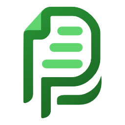
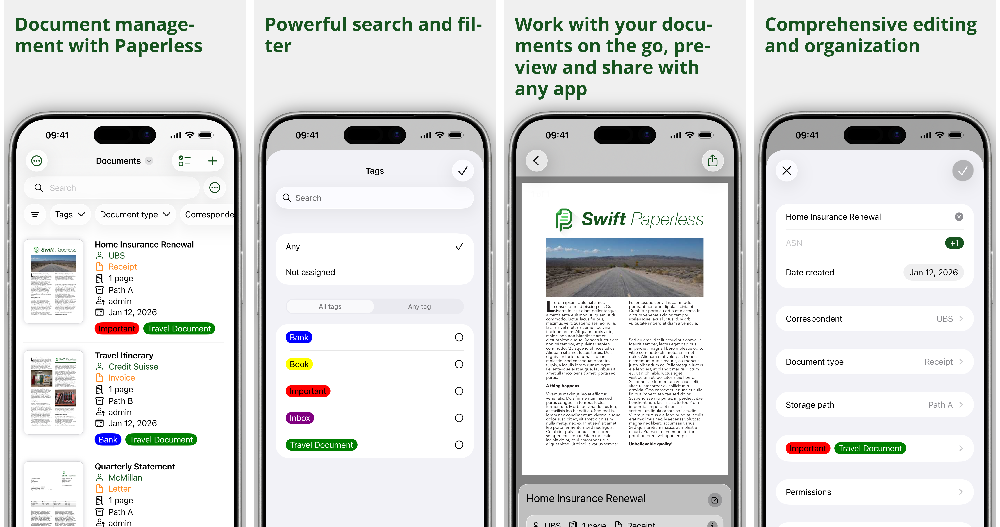

<p align="center" style="margin-bottom:0.25em">



</p>

<h1 align="center" style="margin-top:0em;margin-bottom:0.25em;">
Swift Paperless
</h1>

<p align="center">
<a href="https://apps.apple.com/app/swift-paperless/id6448698521">

</a>
</p>

<h2 align="center" style="margin-top:0.25em;">
iOS app for <a href="https://github.com/paperless-ngx/paperless-ngx">Paperless-ngx</a>
</h2>

<a href="https://crowdin.com/project/swift-paperless">

</a>

<hr/>

<a href="https://apps.apple.com/app/swift-paperless/id6448698521">

</a>

---

**Swift Paperless** native iOS app for the
[Paperless-ngx](https://github.com/paperless-ngx/paperless-ngx) software.
Paperless-ngx is a self-hosted document management system that helps you
organize your documents digitally.

This application requires a self-hosted instance to function!

- [Documentation](https://paulgessinger.github.io/swift-paperless/)

## TestFlight

To get the latest development version of the app, grab it on
[TestFlight](https://testflight.apple.com/join/bOpOdzwL)!

## Building from source

The Xcode project is **generated** with [XcodeGen](https://github.com/yonaskolb/XcodeGen)
from [`project.yml`](project.yml); build settings live in [`Config/`](Config) as
`.xcconfig` files. `swift-paperless.xcodeproj` is not committed — generate it before
opening or building:

```console
brew install xcodegen   # once
just generate           # or: xcodegen generate
open swift-paperless.xcodeproj
```

`just build` / `just test-xcode` regenerate the project automatically. Edit
`project.yml` (targets, sources, dependencies) and `Config/*.xcconfig` (build
settings) rather than the generated project, then re-run `just generate`.

## Contact

If you have any questions or need support create an issue on [GitHub](https://github.com/paulgessinger/swift-paperless/issues/new) or send me a [message](mailto:swift-paperless@paulgessinger.com).

## Maintenance

Automation lives in the [`scripts/`](scripts/) package (`swpngx`) and
[`fastlane/`](fastlane/). Run `swpngx` via `uv run --project scripts swpngx …`
from the repo root (or install the package so `swpngx` is on your `PATH`).

Device ids, simulator names, bezel PNGs, and framing geometry are defined once in
[`screenshot_devices.toml`](screenshot_devices.toml). [`screenshots.toml`](screenshots.toml)
references those ids for capture; [`frames.toml`](frames.toml) references the same file
for framing. iPhone screenshots use **Pro Max only** (App Store Connect scales for smaller
phones). Check alignment with:

```console
uv run --project scripts swpngx devices check
```

### App Store screenshots

**1. Capture** raw simulator PNGs (config: [`screenshots.toml`](screenshots.toml)):

```console
uv run --project scripts swpngx capture setup
# Or pin the screenshot backend:
uv run --project scripts swpngx capture setup --pngx-tag 2.19.4
# Or add random tags for UI stress testing:
uv run --project scripts swpngx capture setup --random-tags 1000
# Or add multiple random metadata types:
uv run --project scripts swpngx capture setup --random-tags 1000 --random-correspondents 500 --random-document-types 250
uv run --project scripts swpngx capture capture
```

Writes files like `fastlane/screenshots/en-US/iPhone_17_Pro_Max-01_documents.png`
(the prefix is the device `id` from `screenshot_devices.toml`). Tear down the backend
with `uv run --project scripts swpngx capture teardown`.

**2. Install device bezels** from [Apple Design Resources](https://developer.apple.com/design/resources/)
(Product Bezels). Each `[[device]]` in [`screenshot_devices.toml`](screenshot_devices.toml)
names a `bezel_pack` from [`bezel_packs.toml`](bezel_packs.toml) and the PNG filename
to install under `fastlane/screenshots/frames/`:

```console
# Use DMGs you already downloaded (e.g. from ~/Downloads):
uv run --project scripts swpngx frames download --dmg-dir ~/Downloads

# Or let swpngx download from Apple into ~/Library/Caches/swpngx/bezels:
uv run --project scripts swpngx frames download

# Only the iPhone 17 pack, with one DMG path:
uv run --project scripts swpngx frames download --pack iphone_17 \
  --dmg-path ~/Downloads/Bezel-iPhone-17.dmg
```

Requires macOS (`hdiutil`). Apple’s DMG license prompt is accepted automatically
(`Y`); you must comply with the [Apple Design Resources license](https://developer.apple.com/design/resources/).

**3. Frame** screenshots for the App Store (config: [`frames.toml`](frames.toml)):

```console
uv run --project scripts swpngx frame
```

Reads `fastlane/screenshots/<locale>/`, composites device bezels and localized
titles (from [`fastlane/screenshots/Screenshots.xcstrings`](fastlane/screenshots/Screenshots.xcstrings)),
and writes `fastlane/screenshots/framed/<locale>/*-framed.png`. Device names in
filenames must match device `id` in `screenshot_devices.toml`.

The framing font (Open Sans) is not in git (`fastlane/.gitignore` ignores `*.ttf`).
`swpngx frame` downloads it automatically from [Google Fonts](https://fonts.google.com/specimen/Open+Sans)
via [`fonts.toml`](fonts.toml), or you can prefetch:

```console
uv run --project scripts swpngx fonts download
```

Preview locally:

```console
uv run --project scripts swpngx preview
```

**4. Upload** metadata and framed screenshots with [deliver](https://docs.fastlane.tools/actions/deliver/)
(config: [`fastlane/Deliverfile`](fastlane/Deliverfile)):

```console
just deliver-preview    # dry run
just deliver              # metadata + screenshots
just deliver-metadata     # metadata only (What's New, description, …)
```

`just deliver` uploads **both** metadata and screenshots in one `fastlane deliver`
run (not a separate command). It uses `MARKETING_VERSION` from
`Config/Shared/Version.xcconfig`, replaces all screenshots, and reads metadata
from `fastlane/metadata/`.

**What's New** is edited only in `fastlane/metadata/default/release_notes.txt`.
The Deliverfile reads that once and applies it to every metadata locale (including
`en-US`, which App Store Connect does not fill from `default/` on its own).

Before uploading:
- Edit `fastlane/metadata/default/release_notes.txt` for the new version.
`skip_binary_upload` is enabled in the Deliverfile, so this uploads **metadata and
screenshots only** (no IPA). TestFlight builds use `just beta` / `fastlane beta`
separately.

Authentication uses the same App Store Connect API key as TestFlight
(`APP_STORE_CONNECT_API_KEY_ID`, `APP_STORE_CONNECT_ISSUER_ID`, and
`APP_STORE_CONNECT_KEY_FILEPATH` or `APP_STORE_CONNECT_KEY_CONTENT`), plus
`APPLE_ID`, `ITC_TEAM_ID`, and `TEAM_ID` from [`fastlane/Appfile`](fastlane/Appfile).

PNG screenshots under `fastlane/screenshots/` are gitignored; generate them locally
before upload.

There is also `bundle exec fastlane screenshots` (`snapshot` + [`fastlane/Snapfile`](fastlane/Snapfile)),
a UI-test-based path that is separate from the `swpngx` workflow above.

### Panorama montage

Concatenate framed screenshots (adjust the glob for your device name):

```console
montage fastlane/screenshots/framed/en-US/iPhone_17_Pro_Max-01_*-framed.png \
    -tile 4x1 -geometry +20+0 panorama.png
```
