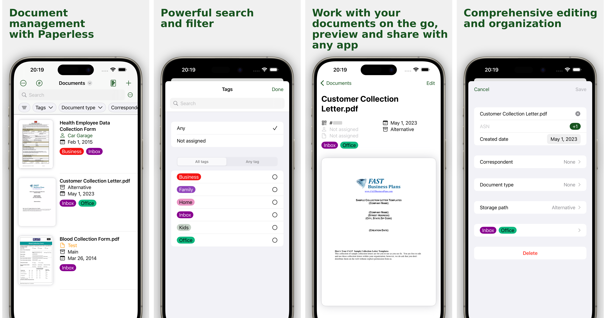

# Native Swift app for [Paperless-ngx](https://github.com/paperless-ngx/paperless-ngx)

This repository is for a native Swift iOS app for the
[Paperless-ngx](https://github.com/paperless-ngx/paperless-ngx) software.
Paperless-ngx is a self-hosted document management system that helps you
organize your documents digitally.

This application requires a self-hosted instance to function.

You can check it out in [TestFlight](https://testflight.apple.com/join/bOpOdzwL)!

## Where's the code?

For the time being, this repository is only used for the issue tracker.  Once
the app is published on the App Store, the full app code will be added to this
repository.
