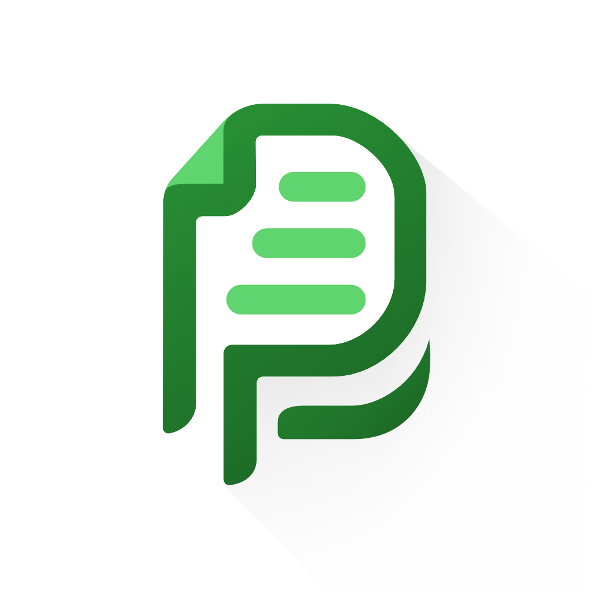

<p align="center" style="margin-bottom:0.25em">



</p>

<h1 align="center" style="margin-top:0em;margin-bottom:0.25em;">
Swift Paperless
</h1>

<p align="center">
<a href="https://apps.apple.com/app/swift-paperless/id6448698521">

</a>
</p>

<h2 align="center" style="margin-top:0.25em;">
iOS app for <a href="https://github.com/paperless-ngx/paperless-ngx">Paperless-ngx</a>
</h2>

<a href="https://crowdin.com/project/swift-paperless">

</a>

<hr/>

<a href="https://apps.apple.com/app/swift-paperless/id6448698521">

</a>

---

**Swift Paperless** native iOS app for the
[Paperless-ngx](https://github.com/paperless-ngx/paperless-ngx) software.
Paperless-ngx is a self-hosted document management system that helps you
organize your documents digitally.

This application requires a self-hosted instance to function!

- [Documentation](https://paulgessinger.github.io/swift-paperless/)

## TestFlight

To get the latest development version of the app, grab it on
[TestFlight](https://testflight.apple.com/join/bOpOdzwL)!

## Contact

If you have any questions or need support create an issue on [GitHub](https://github.com/paulgessinger/swift-paperless/issues/new) or send me a [message](mailto:swift-paperless@paulgessinger.com).

## Maintenance

- Run the screenshot automation:

```console
fastlane snapshot
scripts/frame.py fastlane/screenshots
fastlane deliver
```

- Concatenate screenshots for panorama:

```console
montage fastlane/screenshots/framed/en-US/iPhone\ 15\ Pro\ Max-0* \
    -tile 4x1 -geometry +20+0 panorama.png
```
