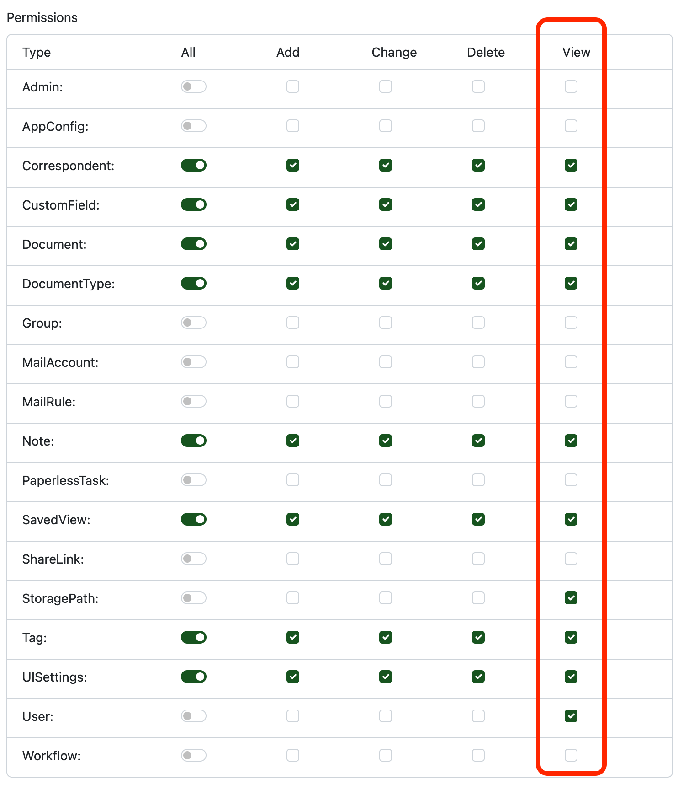

# Error "No access: XXX"

!!! note

    In versions up to and including `v1.7.2`, the app required at least
    read-access to most of the resources available in Paperless-ngx. Starting from
    `v1.8.0`, only a minimal set of permissions is required to access the app. See
    [Minimum permissions](minimum-permissions.md) for more information.

This error occurs when the user does not have the necessary permissions to access the requested resource. This is usually the result of a faulty configuation in Paperless-ngx itself.

To resolve this issue, please navigate to the *Users & Groups* page in the *Administration* section, and make sure that the *View* checkbox is ticked for the user in question.

