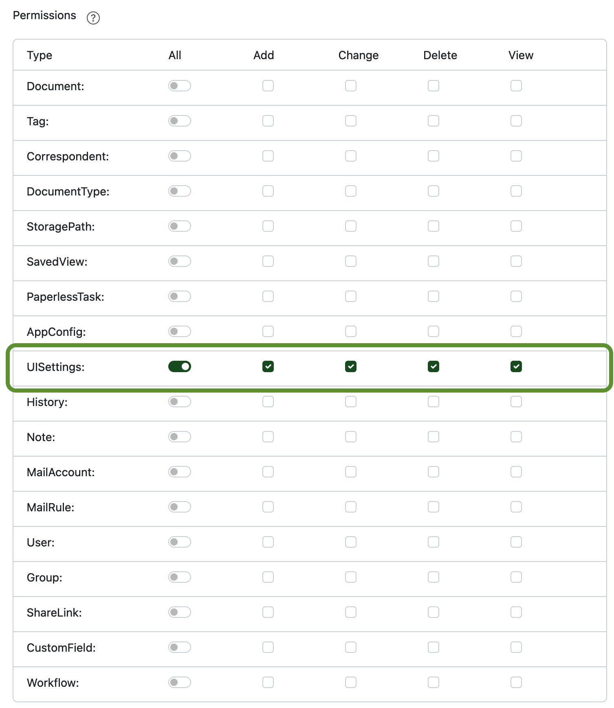

# Minimum permissions

Permissions in Paperless-ngx control what resources a logged in user has access to.
Generally, Swift Paperless will respect the given permissions and not try to load resources
that the user will not be able to access.

For the app to function correctly, it needs to be able to query information about the logged in user itself,
which includes the level of permissions the user has. Without this level of access, the functionality of the app cannot be provided.

Please ensure that the user you're trying to log in with has at leas the *UI Settings* permissions set in the web interface under *Users & Groups*:

