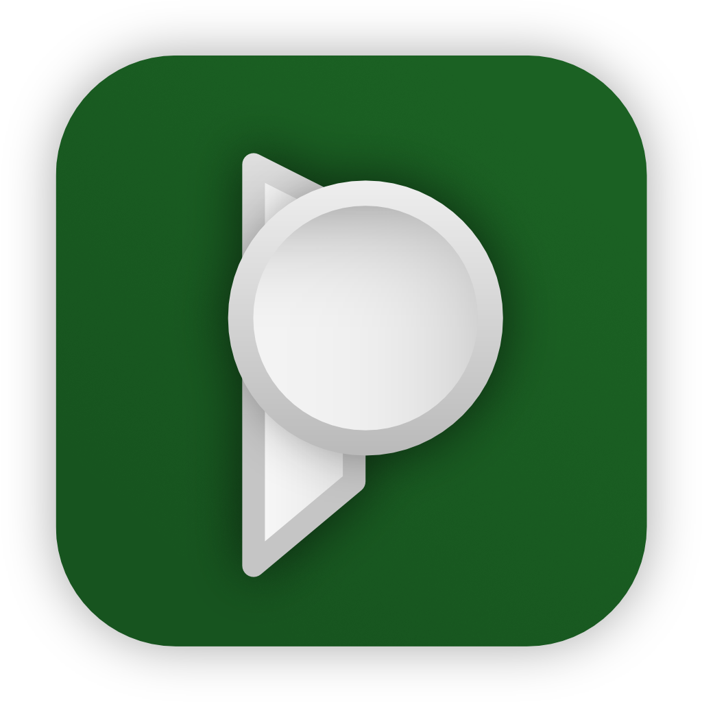

# v1.2.0

## 🚀 Features

- **Multi-server support** 🎉: It is now possible to add multiple servers to the app! You can also use
  this feature to log in to the same server with multiple users. When sharing documents with the app, it’s now possible to choose which server to upload to.
- **Processing task management** ✏️: Added new screens to view all tasks currently being tracked by the server. The app monitors tasks when documents are added, and will notify you of failed processing (e.g. in case of duplicate documents).

- New app icon:
    - You can choose between three available App Icons in the settings

- Danish translation added (thanks to [@PTST](https://github.com/PTST))
- Add the ability to sort by storage paths
- Add the ability to pick photos from the photo library, and to share pictures with the app to be uploaded
- Allow using all fulltext search modes, in addition to “Title & Content”
- Allow settings the default search mode and default sort field and order

## 🐛 Bug Fixes
- Incorrect display if the document aspect ratio is not A4-ish

## 🚜 Refactor
- Much improved error logging and error handling. Many common errors should now
  produce more concrete error messages, and if possible link to the appropriate
  documentation page. This should make it easier to troubleshoot issues.
- App layout update: saved views can now be selected from the navigation title at the very top of the document screen

## ⚙️ Miscellaneous
- Surface app version in settings, add to feedback email
